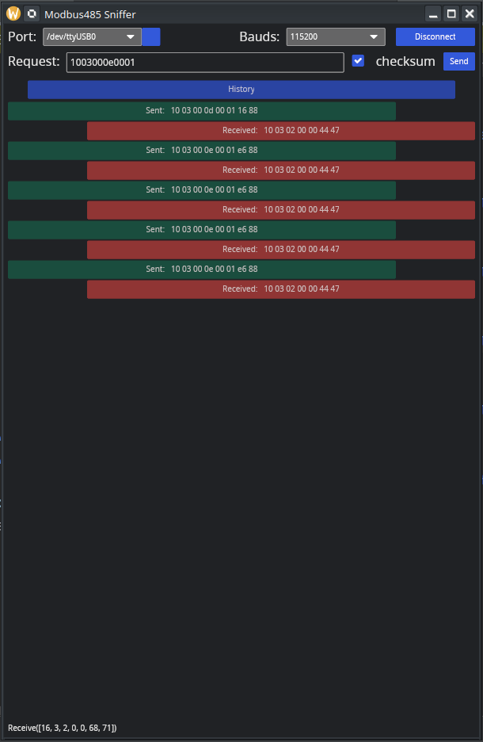

## Introduction
Modbus485 Sniffer is a diagnostic tool designed for listening and interacting with RS485 lines using the 
Modbus protocol. It enables users to manually send raw requests and monitor responses in a user-friendly 
GUI environment. This tool is ideal for debugging and developing systems using RS485 serial communication.

It has been tested only under linux but should work also under other Unix OS or Windows.

## Features
- **Port Selection**: Choose from available RS485 ports.
- **Baud Rate Configuration**: Select between standard baud rates (9600, 19200, 38400, 115200).
- **Raw Data Interaction**: Manually send raw Modbus requests and view responses.
- **Live Data Monitoring**: Real-time display of data flowing through the RS485 line.
- **Error Display**: Visual feedback on incorrect or problematic requests.
- **Checksum Calculation**: Automatic CRC computation for requests, that can be disabled.

## Contributing
Contributions to Modbus485 are welcome. Please ensure that your code adheres to the existing style and structure 
of the project. Submit a pull request with a clear description of the changes and improvements.

## Support
For support, feature requests, or bug reports, please file an issue on the GitHub repository.
